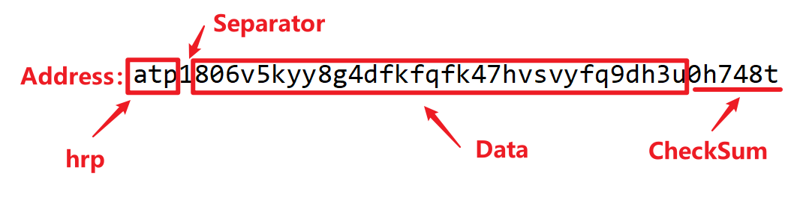

PlatONet是PlatON/Alaya网络的dotnet sdk，通过PlatONet，开发人员能够使用dotnet(如c#，C++等)接入PlatON/Alaya网络，查询PlatON/Alaya网络的相关参数，如发送lat/atp，与智能合约进行交互，执行PlatON/Alaya网络的内置合约等。PlatONet包含client-java-sdk的所有功能。

项目仓库：[https://github.com/RileyGe/PlatONet](https://github.com/RileyGe/PlatONet)

API文档：[PlatONet API文档](https://rileyge.github.io/platonet-documents/api/)


## 快速开始

本文旨在让有dotnet、区块链开发经验的开发者可以快速使用PlatONet。

### 项目适用平台

PlatONet符合.net standard 2.0标准，可以广泛的应用于Windows、Mac、Linux等操作系统。

### 安装与使用

打开Nuget命令行工具，运行以下命令：

```powershell
Install-Package PlatONet
```

或使用Visual Studio的NuGet包管理器，搜索并安装`PlatONet`。

## 示例

[PlatONet](https://github.com/RileyGe/PlatONet)项目包含了非常多的示例，可以帮助用户快速开始使用PlatONet。具体请参照：[PlatONet示例](https://github.com/RileyGe/PlatONet/tree/main/examples)。示例基础.net core 3.1。

## 文档

文档地址：https://rileyge.github.io/platonet-documents/

### 项目结构

PlatONet的结构非常简单，主要包含了三个命名：`PlatONet`、`PlatONet.Crypto`、`PlatONet.DTOs`。其中`PlatONet.Crypto`主要是一些加密算法，仅供项目内部使用，对外公开的只有`PlatONet`和`PlatONet.DTOs`两个命名空间。

#### PlatONet命名空间

PlatONet的主体内容都存在于这个命名空间中，主要有以下几个类：

- Web3类：最重要入口，PlatONet的基础，可以用于查询网络基础信息、管理账号、PlatON类、PPOS类。
- PlatON类：PlatON网络类，用于交易和查询，也可以生成PlatONContract类与智能合约进行交互。
- PlatONContract类：智能合约类，用于与PlatON网络中的智能合约进行交互，也可以生成PlatONFunction。
- PlatONFunction类：智能合约方法类，直接调用智能合约的方法，进行交易等。
- Transaction类：交易信息类，进行交易内容的管理
- Account类：账号管理、签名。
- Address类：地址类，进行地址管理。

#### PlatONet.DTOs命名空间

此命名空间中包含多个数据传输对象（Data Transfer Objects），主要用于数据传输。


### 运行第一次PlatONet查询

```csharp
using System;
using PlatONet;

namespace examples
{
    public class Basic
    {
        public static void Main(string[] args)
        {
            var platonWeb3 = new Web3("http://35.247.155.162:6789"); // dev net of platon
            var version = platonWeb3.GetProgramVersion();
            Console.WriteLine(version);
            var chainId = platonWeb3.GetChainId();
            Console.WriteLine(chainId);            
        }
    }
}
```

### 进行一次转账

```csharp
using PlatONet;
using System;

namespace examples
{
    public class Transfer
    {
        public static void Main(string[] args)
        {
            var privateKey = "d08baac64f52ae1b9c2ea559036650229f07f5d61d869dbb55562a9827fbaeb8";
            var w3 = new Web3("http://35.247.155.162:6789", privateKey); // dev net of platon
            var toAddress = "lat1ljlf4myhux0zahfmlxf79wr7sl8u7pdey88dyp";
            var amount = new HexBigInteger((ulong)1e18);
            var gasPrice = new HexBigInteger((ulong)1e9);
            var gasLimit = new HexBigInteger(21000);            
            var nonceNum = w3.PlatON.GetTransactionCount();

            // 构建交易
            var tx = new Transaction(toAddress, amount, nonceNum, gasPrice, gasLimit);
            //发送交易
            var result = w3.PlatON.SendTransaction(tx);
            Console.WriteLine(result);
        }
    }
}
```

### 智能合约部署

```csharp
using PlatONet;
using System;

namespace examples
{
    public class ContractDeploy
    {
        public static void Main(string[] args)
        {
            var bytecode = "0x608060405234801561001057600080fd5b50610429806100206000396000f3fe608060405234801561001057600080fd5b50600436106100365760003560e01c806317d7de7c1461003b578063c47f0027146100be575b600080fd5b6100436101f2565b6040518080602001828103825283818151815260200191508051906020019080838360005b83811015610083578082015181840152602081019050610068565b50505050905090810190601f1680156100b05780820380516001836020036101000a031916815260200191505b509250505060405180910390f35b610177600480360360208110156100d457600080fd5b81019080803590602001906401000000008111156100f157600080fd5b82018360208201111561010357600080fd5b8035906020019184600183028401116401000000008311171561012557600080fd5b91908080601f016020809104026020016040519081016040528093929190818152602001838380828437600081840152601f19601f820116905080830192505050505050509192919290505050610294565b6040518080602001828103825283818151815260200191508051906020019080838360005b838110156101b757808201518184015260208101905061019c565b50505050905090810190601f1680156101e45780820380516001836020036101000a031916815260200191505b509250505060405180910390f35b606060008054600181600116156101000203166002900480601f01602080910402602001604051908101604052809291908181526020018280546001816001161561010002031660029004801561028a5780601f1061025f5761010080835404028352916020019161028a565b820191906000526020600020905b81548152906001019060200180831161026d57829003601f168201915b5050505050905090565b606081600090805190602001906102ac92919061034f565b5060008054600181600116156101000203166002900480601f0160208091040260200160405190810160405280929190818152602001828054600181600116156101000203166002900480156103435780601f1061031857610100808354040283529160200191610343565b820191906000526020600020905b81548152906001019060200180831161032657829003601f168201915b50505050509050919050565b828054600181600116156101000203166002900490600052602060002090601f016020900481019282601f1061039057805160ff19168380011785556103be565b828001600101855582156103be579182015b828111156103bd5782518255916020019190600101906103a2565b5b5090506103cb91906103cf565b5090565b6103f191905b808211156103ed5760008160009055506001016103d5565b5090565b9056fea265627a7a72315820a89a95b35ad9e15c39082d4e9ece93b95b29072f95af709314ba017e1fb1487764736f6c63430005110032";
            var privateKey = "d08baac64f52ae1b9c2ea559036650229f07f5d61d869dbb55562a9827fbaeb8";
            var w3 = new Web3("http://35.247.155.162:6789", privateKey); // dev net of platon
            var tx = new Transaction()
            {
                GasPrice = 1000000000L.ToHexBigInteger(),
                Data = bytecode
            };
            tx = w3.PlatON.FillTransactionWithDefaultValue(tx);
            var result = w3.PlatON.SendTransaction(tx);
            Console.WriteLine(result);
        }
    }
}
```

### 与智能合约进行一次交互

```csharp
using PlatONet;
using System;

namespace examples
{
    public class Contract3
    {
        public static void Main(string[] args)
        {
            var privateKey = "d08baac64f52ae1b9c2ea559036650229f07f5d61d869dbb55562a9827fbaeb8";
            var w3 = new Web3("http://35.247.155.162:6789", privateKey);
            var abi = @"[
        {
          ""constant"": false,
          ""inputs"": [
            {
              ""internalType"": ""string"",
              ""name"": ""_name"",
              ""type"": ""string""
            }
          ],
          ""name"": ""setName"",
          ""outputs"": [
            {
              ""internalType"": ""string"",
              ""name"": """",
              ""type"": ""string""
            }
          ],
          ""payable"": false,
          ""stateMutability"": ""nonpayable"",
          ""type"": ""function""
        },
        {
          ""constant"": true,
          ""inputs"": [],
          ""name"": ""getName"",
          ""outputs"": [
            {
              ""internalType"": ""string"",
              ""name"": """",
              ""type"": ""string""
            }
          ],
          ""payable"": false,
          ""stateMutability"": ""view"",
          ""type"": ""function""
        }
      ]";
            var contractAddress = new Address("lat1ts7u6ekl9zfmqw399wvnfh2gxc5gkjv34ymkvt");
            var contract = w3.PlatON.GetContract(abi, contractAddress.ToString());
            var result = contract.GetFunction("getName").Call<string>();
            Console.WriteLine(result);
            var nameResult = contract.GetFunction("setName").SendTransaction("abcabc");
            Console.WriteLine(nameResult);
        }
    }
}
```

### 调用一次内置合约

```csharp
using PlatONet;
using PlatONet.DTOs;
using System;

namespace examples
{
    public class PPOS
    {
        public static void Main(string[] args)
        {
            var privateKey = "d08baac64f52ae1b9c2ea559036650229f07f5d61d869dbb55562a9827fbaeb8";
            var w3 = new Web3("http://35.247.155.162:6789", privateKey);
            Console.WriteLine((new Address("lat1d4vw2qxjg5ldyaqceel3s6ykpljav6hcn0jfmh")).ToEthereumAddress());
            var ppos = w3.PlatON.PPOS;
            var nodeId = "0x177226cb3440cec3b8e7b7d591fde985665a3fc1e069a7f9db86080350cb91e8ecb1cad35ed786ee22256229182f79909dcf7431b58e58c9a706935b6046ffb2";
            var result = ppos.GetStakingInfo(nodeId);
            Console.WriteLine(result);

            string hash = ppos.Delegate(nodeId, StakingAmountType.FREE_AMOUNT_TYPE,
                ((ulong)1e19).ToHexBigInteger());
            Console.WriteLine(hash);            
        }
    }
}
```

相信有了前面的这些简单的例子，大家就能很快的开始使用PlatONet了，Enjoy！！！


## 使用PlatONet连接PlatON网络并查询基本信息

查询网络基本信息是最常用，也最简单的操作。本节教程只涉及查询PlatON网络的公开信息，所以不需要使用账号，只需要一个PlatON网络的接入点即可。本教程只用到了Web3及PlatON类。

在PlatONet中，Web3类借鉴了Ethereum网络的Web3.js。Web3是网络的统一接口，使用Web3类，可以便捷的管理交易（Transaction）及账号（Account）等操作。Web3可以生成一个PlatON类，PlatON类对标的为Web3.js中的eth类，在PlatON类中主要包含了与区块链相关的方法。

所以，在使用Web3类之前，必须指定相应网络的接入点。PlatONet支持的网络有：

- PlatON主网
- PlatON开发网
- PlatON私有网络
- Alaya主网
- Alaya开发网
- Alaya私有网络

PlatONet支持上述所有的网络。在接入网络之前，你需要一个接入点。你可以自建接入点（请参照：[私有网络 | PlatON](https://devdocs.platon.network/docs/zh-CN/Build_Private_Chain)、[成为主网节点 | PlatON](https://devdocs.platon.network/docs/zh-CN/Become_PlatON_Main_Verification)、[私有网络 | Alaya](https://devdocs.alaya.network/alaya-devdocs/zh-CN/Private_network)、[主网全节点部署 | Alaya](https://devdocs.alaya.network/alaya-devdocs/zh-CN/Run_a_fullnode)），你可以使用官方提供的公共接入点（请参照：[开发网络 | PlatON](https://devdocs.platon.network/docs/zh-CN/Join_Dev_Network)、[开发网络 | Alaya](https://devdocs.alaya.network/alaya-devdocs/zh-CN/Join_the_dev_network)）。本教程连接的网络为PlatON开发网，使用官方提供的公共接入点。

选好网络，准备好接入点，查询工作就可以开始了。下述代码主要来自 `Basic.cs` ：

```csharp
using System;
using PlatONet;

namespace examples
{
    public class Basic
    {
        public static void Main(string[] args)
        {
            var w3 = new Web3("http://35.247.155.162:6789"); // dev net of platon
            var version = w3.GetProgramVersion();
            Console.WriteLine(version);
            var chainId = w3.GetChainId();
            Console.WriteLine(chainId.Value);

            // 快捷生成一个PlatON类的实例
            var platon = w3.PlatON;
            Console.WriteLine(platon.ProtocolVersion());
            Console.WriteLine(platon.GasPrice().Value);
            Console.WriteLine(platon.GetBalance("lat1d4vw2qxjg5ldyaqceel3s6ykpljav6hcn0jfmh").Value);          
            Console.WriteLine(platon.GetTransactionCount("lat1l32ggvel6ndxxlprplz04c3vm2mq4wtgvugn36").Value);
        }
    }
}
```

注意：上述代码无法在所有网站中都正常运行，这是由于不同网络的地址格式及相关Hash都不尽相同，请在使用前修改为相应网站的相关地址。

本教程主要介绍了PlatONet所支持的网络及Web3的基本使用方法。本节的内容比较简单，只涉及了Web3类及PlatON类的简单使用方法，后续会介绍更复杂的使用方法。

##  账号、地址及转账操作

本篇会介绍账号的相关知识及账号生成的相关操作。本教程分为两大部分，第一部分为账号的基本概念，在这里你能学到一些相关账号的基本概念，以及一些安全方面的建议。如果你对此部分内容比较熟悉或不感兴趣，可以直接跳过第一部分，进入第二部分账号生成。在第二部分中主要讲操作，本教程会带领大家用PlatONet成账号，参与PlatON/Alaya网络交易。

### 基本概念

如果你是第一次接触区块链，那么PlatON/Alaya的账号（Account）的概念对你来说可能难以理解。Alaya的账号与中心化的账号有很大不同。无论你在银行还是其他中心化的应用中，如微信，支付宝等，你都要准备好资料并向中心化的组织来提交你的资料，你才能开户一个账号。但在PlatON/Alaya中，你可以自行生成一个公私钥对，如果你将你的账号地址（Address）分享给大家，大家就可以与你的账号发生交互了。

这里已经出现了账号、公钥、私钥及地址等概念，不要着急，下面我们就慢慢的一一解释这些概念。我们先看下面一张图片：


### 账户（Accounts）

在进行正式解释之前，我们先做一下类比。PlatON/Alaya中的**普通账号**和银行账号有很大的相似之外。你的银行账号里面会记录你账号上有多少钱，进行过什么操作等。PlatON/Alaya中也一样，PlatON/Alaya网络会维护一棵状态树，该树以账号地址为索引，存储账号的余额（balance）、交易计数（nonce）等。

PlatON/Alaya还有另外一种账号是**合约账号**，通常我们也直接称之为合约。合约账号和普通账号的信息都存储于同一棵树中，合约也有余额（balance）、交易计数（nonce）等，同时他还具有代码等。

### 地址（Address）

如果类比一下，地址就是你银行账户的银行卡号。在PlatON/Alaya网络中，一个PlatON/Alaya地址就代表着一个账户，地址是账户的标识。也就是如我们1.1中所说，PlatON/Alaya中的状态树是以地址为索引的。

与银行账号不同的是，如果别人知道了你的账号地址，那么任何人都可以通过你的地址查询到你的所有交易。

不知大家发现没有，在PlatON网络中，所有地址都是以lat1开头的（在Alaya网络中以atp1开头），这是为什么呢？这是由于为了提高地址的可读性，PlatON/Alaya网络将原地址（一般使用16进制表示，如常见的0x开头的以太坊地址）经过Bech32编码，形成了现有地址。

>Bech32最早出现在 Bitcoin 中，其组成如下：
>
>hrp(human-readable part)：可读前缀
>seperator：分隔符，永远是“1”。
>data part：数据部分，包含小写字母和数字。但数据部分不可包含字符“1”（被用作了分隔符），“b”、“i”、“o”（可读性不强，容易与其他字符混淆）。这样数据部分每一位都有32位可能取值。
>checksum：校验部分。校验部分为地址的最后 6 位，可用于校验该字符串的正确性。
>
>下图为地址组成部分示意图：
>
>

### 私钥（Private Key）和公钥（Public Key）

私钥和公钥是非对称加密中的概念。在非对称加密中，我们通过某种算法来生成一个公私钥对，这个公私钥对有以下特征：

- 知道公钥不可能（或者是非常难）推算出私钥，但知道私钥很容易推算出私钥。
- 用公钥进行加密后的数据只有使用私钥才能对其解密。
- 用私钥对数据进行签名后用公钥可以验证签名的正确性。

那么公私钥前面的账号和地址有什么关系呢？先说结论：

- 私钥的持有者对账号有所有权，可以对账号进行任何PlatON/Alaya网络支持的操作。
- 地址是由公钥经Hash操作得到的。也就是说**由公钥可以容易的获得地址，但有地址却无法推算出公钥**。

> 安全提醒：
>
> 1. 由于私钥的持有者可以对账号进行任何Alaya支持的操作，所以如果你的私钥丢失，那么你将完全的失去你的账号，任何人对此都无能为力。
> 2. 账号进行过发送操作，其公钥就会暴露。从某种角度来讲，其安全性确实降低了。但在现有的技术水平下，公钥暴露完全造成的安全影响非常微小。到目前为止，所有区块链项目都没有因为公钥暴露而产生安全问题。

### 助记词

助记词从名字就能看出来是干嘛的。之前说过私钥非常非常重要，但私钥又非常非常长（否则容易被破解），私钥也完全没有任何顺序，没有任何意义（否则容易被人破解）。所以为了帮助大家更好的记忆私钥，大家会有一些常用的单词，来代表私钥，这样私钥就容易记录一些了。

也就是说助记词是可以和私钥相互转化，但同时又比较好记的一种私钥保存形式。私钥与助记词的转化一般是周边工具提供的功能，而不是区块链本身的功能。

好，基本概念就讲这么多，下面就开始实操。

### 转账操作

转账操作虽然看起来简单，但实际上是一个非常完整的进行区块链交易的过程，通过转账操作，开发者基本上就可以掌握Account类、Transaction类、Web3类、PlatON类的最基本用法。Web3类和PlatON在教程《查询操作》中已经进行过基本介绍，这里就再介绍一下Account类及Transaction类：

- **Account**：账号相关操作，最核心的功能是签名操作。而且还在此类中通过静态方法的形式提供了与助记词相关的操作。下面的示例代码中会演示如何使用私钥、助记词生成账号，也会展示如何生成随机账号。
- **Transaction**：交易相关操作，核心功能是构建不同的交易。

还是从代码开始讲解：

```csharp
using PlatONet;
using System;

namespace examples
{
    public class Transfer
    {
        public static void Main(string[] args)
        {
            var mneno = Account.GenerateMnemonic(); // 9
            var act = Account.FromMnemonic(mneno); // 10
            var privateKey = "d08baac64f52ae1b9c2ea559036650229f07f5d61d869dbb55562a9827fbaeb8";
            var act2 = new Account(privateKey); // 12
            var act3 = new Account(); // 13
            var w3 = new Web3("http://35.247.155.162:6789", privateKey); // 14
            var toAddress = "lat1ljlf4myhux0zahfmlxf79wr7sl8u7pdey88dyp";
            var amount = new HexBigInteger((ulong)1e18);
            var gasPrice = new HexBigInteger((ulong)1e9);
            var gasLimit = new HexBigInteger(21000);            
            var nonceNum = w3.PlatON.GetTransactionCount();

            // 构建交易
            var tx = new Transaction(toAddress, amount, nonceNum, gasPrice, gasLimit); // 22
            //发送交易
            var result = w3.PlatON.SendTransaction(tx); // 24
            Console.WriteLine(result);
        }
    }
}
```

- 第9行：如何生成一个随机的助记词。
- 第10、12、13行：如果通过助记词、私钥、随机生成账号。
- 第14行：在构建Web3对象时，不仅传入的接入点相关信息，还传入的账号的私钥。这样就可以让Web3对象对账号进行管理，就可以在第24行发送交易时，自动对交易进行签名。如果在构建Web3对象时没有传入私钥，则也可以通过`w3.InitAccount`方法重新初始化账号，与在构建Web3对象时传入私钥是一样的效果。
- 第22行：构建交易。
- 第24行：发送交易。`w3`对账号进行了自动管理，所以这里不需要签名。否则需要先调用`tx.Sign(account)`方法，然后使用`w3.PlatON.SendRawTransaction(tx.SignedTransaction.ToHex())`发送交易。

转账交易是区块链中最基础、使用最广泛的操作，以上就是使用PlatONet进行转账的操作方法。

## 智能合约操作

智能合约是PlatON/Alaya最核心的功能之一，能过智能合约，用户可以无限制的拓展区块链的应用。ERC20代币、NFT、去中心交易所、DAO等都是智能合约的应用。本文就介绍一下如何通过PlatONet进行智能合约的部署与交互。

> 注：本文不会涉及到如何进行智能合约的编写及编译等相关介绍，如需要相关知识，请参照：[Solidity智能合约开发](https://devdocs.platon.network/docs/zh-CN/Solidity_Dev_Manual)。

### 智能合约部署

文本使用[Solidity智能合约入门手册](https://devdocs.platon.network/docs/zh-CN/Solidity_Dev_Manual)中[创建HelloWorld合约](https://devdocs.platon.network/docs/zh-CN/Solidity_Dev_Manual#%E5%88%9B%E5%BB%BAhelloworld%E5%90%88%E7%BA%A6)章节中的智能合约为例，智能合约代码如下：

```javascript
pragma solidity ^0.5.17;

contract HelloWorld {
    
    string name;
    
    function setName(string memory _name) public returns(string memory){
        name = _name;
        return name;
    }
    
    function getName() public view returns(string memory){
        return name;
    }
}
```

智能合约编译后会产生一串二进制代码（一般使用16进制进行表示、编译方法参照[编译HelloWorld合约](https://devdocs.platon.network/docs/zh-CN/Solidity_Dev_Manual#%E7%BC%96%E8%AF%91helloworld%E5%90%88%E7%BA%A6)），编译结果为：

```csharp
var bytecode = "0x608060405234801561001057600080fd5b50610429806100206000396000f3fe608060405234801561001057600080fd5b50600436106100365760003560e01c806317d7de7c1461003b578063c47f0027146100be575b600080fd5b6100436101f2565b6040518080602001828103825283818151815260200191508051906020019080838360005b83811015610083578082015181840152602081019050610068565b50505050905090810190601f1680156100b05780820380516001836020036101000a031916815260200191505b509250505060405180910390f35b610177600480360360208110156100d457600080fd5b81019080803590602001906401000000008111156100f157600080fd5b82018360208201111561010357600080fd5b8035906020019184600183028401116401000000008311171561012557600080fd5b91908080601f016020809104026020016040519081016040528093929190818152602001838380828437600081840152601f19601f820116905080830192505050505050509192919290505050610294565b6040518080602001828103825283818151815260200191508051906020019080838360005b838110156101b757808201518184015260208101905061019c565b50505050905090810190601f1680156101e45780820380516001836020036101000a031916815260200191505b509250505060405180910390f35b606060008054600181600116156101000203166002900480601f01602080910402602001604051908101604052809291908181526020018280546001816001161561010002031660029004801561028a5780601f1061025f5761010080835404028352916020019161028a565b820191906000526020600020905b81548152906001019060200180831161026d57829003601f168201915b5050505050905090565b606081600090805190602001906102ac92919061034f565b5060008054600181600116156101000203166002900480601f0160208091040260200160405190810160405280929190818152602001828054600181600116156101000203166002900480156103435780601f1061031857610100808354040283529160200191610343565b820191906000526020600020905b81548152906001019060200180831161032657829003601f168201915b50505050509050919050565b828054600181600116156101000203166002900490600052602060002090601f016020900481019282601f1061039057805160ff19168380011785556103be565b828001600101855582156103be579182015b828111156103bd5782518255916020019190600101906103a2565b5b5090506103cb91906103cf565b5090565b6103f191905b808211156103ed5760008160009055506001016103d5565b5090565b9056fea265627a7a72315820a89a95b35ad9e15c39082d4e9ece93b95b29072f95af709314ba017e1fb1487764736f6c63430005110032";
var abi = @"[
        {
          ""constant"": false,
          ""inputs"": [
            {
              ""internalType"": ""string"",
              ""name"": ""_name"",
              ""type"": ""string""
            }
          ],
          ""name"": ""setName"",
          ""outputs"": [
            {
              ""internalType"": ""string"",
              ""name"": """",
              ""type"": ""string""
            }
          ],
          ""payable"": false,
          ""stateMutability"": ""nonpayable"",
          ""type"": ""function""
        },
        {
          ""constant"": true,
          ""inputs"": [],
          ""name"": ""getName"",
          ""outputs"": [
            {
              ""internalType"": ""string"",
              ""name"": """",
              ""type"": ""string""
            }
          ],
          ""payable"": false,
          ""stateMutability"": ""view"",
          ""type"": ""function""
        }
      ]";
```

其中变量bytecode为智能合约编译结果，变量abi为此智能合约的abi。为了表示方便，后面部分的代码可能会直接省略bytecode和abi两个变量的定义，而直接使用上面两个变量。

智能合约部署非常简单，代码如下：

```csharp

namespace examples
{
    public class ContractDeploy
    {
        public static void Main(string[] args)
        {
            var bytecode = "0x608060405234801561001057600080fd5b50610429806100206000396000f3fe608060405234801561001057600080fd5b50600436106100365760003560e01c806317d7de7c1461003b578063c47f0027146100be575b600080fd5b6100436101f2565b6040518080602001828103825283818151815260200191508051906020019080838360005b83811015610083578082015181840152602081019050610068565b50505050905090810190601f1680156100b05780820380516001836020036101000a031916815260200191505b509250505060405180910390f35b610177600480360360208110156100d457600080fd5b81019080803590602001906401000000008111156100f157600080fd5b82018360208201111561010357600080fd5b8035906020019184600183028401116401000000008311171561012557600080fd5b91908080601f016020809104026020016040519081016040528093929190818152602001838380828437600081840152601f19601f820116905080830192505050505050509192919290505050610294565b6040518080602001828103825283818151815260200191508051906020019080838360005b838110156101b757808201518184015260208101905061019c565b50505050905090810190601f1680156101e45780820380516001836020036101000a031916815260200191505b509250505060405180910390f35b606060008054600181600116156101000203166002900480601f01602080910402602001604051908101604052809291908181526020018280546001816001161561010002031660029004801561028a5780601f1061025f5761010080835404028352916020019161028a565b820191906000526020600020905b81548152906001019060200180831161026d57829003601f168201915b5050505050905090565b606081600090805190602001906102ac92919061034f565b5060008054600181600116156101000203166002900480601f0160208091040260200160405190810160405280929190818152602001828054600181600116156101000203166002900480156103435780601f1061031857610100808354040283529160200191610343565b820191906000526020600020905b81548152906001019060200180831161032657829003601f168201915b50505050509050919050565b828054600181600116156101000203166002900490600052602060002090601f016020900481019282601f1061039057805160ff19168380011785556103be565b828001600101855582156103be579182015b828111156103bd5782518255916020019190600101906103a2565b5b5090506103cb91906103cf565b5090565b6103f191905b808211156103ed5760008160009055506001016103d5565b5090565b9056fea265627a7a72315820a89a95b35ad9e15c39082d4e9ece93b95b29072f95af709314ba017e1fb1487764736f6c63430005110032";
            var privateKey = "d08baac64f52ae1b9c2ea559036650229f07f5d61d869dbb55562a9827fbaeb8";
            var w3 = new Web3("http://35.247.155.162:6789", privateKey); // dev net of platon
            var tx = new Transaction()
            {
                GasPrice = 1000000000L.ToHexBigInteger(),  // 12
                Data = bytecode
            };
            tx = w3.PlatON.FillTransactionWithDefaultValue(tx); // 15
            var result = w3.PlatON.SendTransaction(tx);
            Console.WriteLine(result);
        }
    }
}
```

- 第12行：虽然下面第15行的代码也可以对`GasPrice`进行估计，但有时网络默认的`GasPrice`会比较高。这里最好使用比较可信的估计方法。
- 第15行：`FillTransactionWithDefaultValue`是一个可以自动填充Nonce、GasPrice、GasLimit三个参数的快捷方法，在部分场景下非常有用。

智能合约的部署是不是非常简单！

### 与智能合约进行交互

与智能合约的交互我们也从代码开始讲解：

```csharp
using PlatONet;
using System;

namespace examples
{
    public class Contract3
    {
        public static void Main(string[] args)
        {
            var privateKey = "d08baac64f52ae1b9c2ea559036650229f07f5d61d869dbb55562a9827fbaeb8";
            var w3 = new Web3("http://35.247.155.162:6789", privateKey);
            var abi = @"[...请输入ABI...]";
            var contractAddress = "lat1ts7u6ekl9zfmqw399wvnfh2gxc5gkjv34ymkvt"; // 13
            var contract = w3.PlatON.GetContract(abi, contractAddress); // 14
            var result = contract.GetFunction("getName").Call<string>(); // 15
            Console.WriteLine(result); // 16
            var nameResult = contract.GetFunction("setName").SendTransaction("abcabc"); // 17
            Console.WriteLine(nameResult);
        }
    }
}
```

- 与智能合约交互主要有两种方式：
  1. 以15行为代表的查询方式：此方式并不会改变区块链的状态，所以不需要账号信息就可以进行。
  2. 以17行为代表的写交易：此方式会改变区块链的状态，是需要经过账号签名、矿工打包后才能生效的。

- 第14行：使用`abi`和`contractAddress`两个变量生成一个PlatONContract对象的实例。
- 第15行：查询交易的一般使用方法。本例中没有使用参数，传参数的方法和第17行的传参方法相同。参数的数量和类型需要与abi中定义的相同。
- 第17行：写交易的一般使用方法。注：由于写交易需要经过账号签名，所以需要初始化账号信息后才能使用。否则必须手动签名，手动构建`Transaction`后，使用`SendRawTransaction`进行发送。

了解了这些，开发者就可以非常流畅的与智能合约进行交互了！

## 系统合约交互

在链启动之后系统内部已经内置了部分合约，这些合约的地址已固定，功能已实现，其中一部分合约为经济模型的实现，并提供各类合约接口与客户端进行交互。更多详细内容请参照：[系统合约](https://devdocs.platon.network/docs/zh-CN/PlatON_system_contract)。

从原理上来讲，系统合约与普通合约的交互方式相同，用户可以自行构造abi来使用与普通智能合约交互的方式来与系统合约进行交互。但PlatONet已经将系统合约进行了封装，使用户可以更便捷使用系统合约。封装后开发者可以像使用普通函数一样与系统合约交互。

```csharp
using PlatONet;
using PlatONet.DTOs;
using System;

namespace examples
{
    public class PPOS
    {
        public static void Main(string[] args)
        {
            var privateKey = "d08baac64f52ae1b9c2ea559036650229f07f5d61d869dbb55562a9827fbaeb8";
            var w3 = new Web3("http://35.247.155.162:6789", privateKey);
            var ppos = w3.PlatON.PPOS; // 13
            var nodeId = "0x177226cb3440cec3b8e7b7d591fde985665a3fc1e069a7f9db86080350cb91e8ecb1cad35ed786ee22256229182f79909dcf7431b58e58c9a706935b6046ffb2";
            var result = ppos.GetStakingInfo(nodeId); // 15
            Console.WriteLine(result);

            string hash = ppos.Delegate(nodeId, StakingAmountType.FREE_AMOUNT_TYPE,
                ((ulong)1e19).ToHexBigInteger()); // 19
            Console.WriteLine(hash);
        }
    }
}
```

- 第13行：`ppos`变量是为了方便书写而定义的，如果后面全部使用`w3.PlatON.PPOS`替代`ppos`效果是相同的。
- 第15行：查询系统合约状态。由此可以看出，PlatONet已经将系统合约封装成普通函数，就像调用普通函数一样调用即可。
- 第18~19行：写系统合约调用。由于此操作涉及区块链的写操作，会改变区块链状态，需要在使用前初始化账号，否则会调用失败。


本教程贡献者 [@RileyGe](https://github.com/RileyGe)


